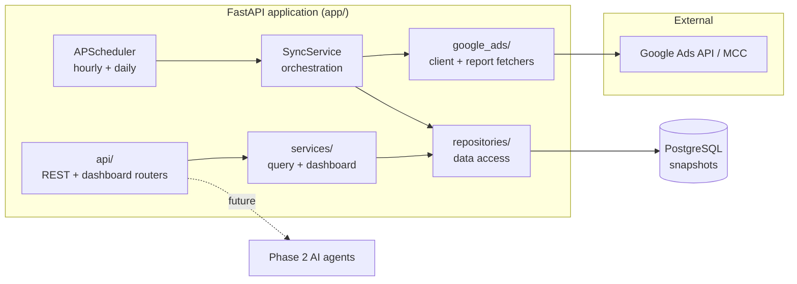
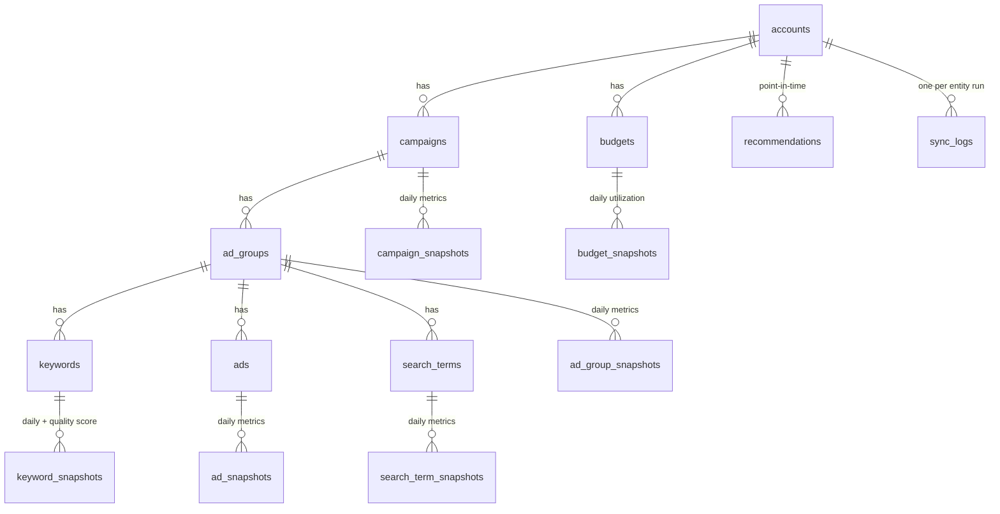

# Google Ads Intelligence Layer — Phase 1

An internal, production-grade backend that continuously syncs Google Ads data
for multiple client accounts (colleges/universities) under a Manager Account
(MCC) into PostgreSQL as **append-only historical snapshots**, and exposes clean
REST + dashboard APIs.

> **Phase 1 is data collection only.** No AI, no LLMs, no automated decisions, no
> changes pushed back to Google Ads. The architecture is deliberately layered so
> Phase 2 AI agents can consume this historical data through the same APIs.

---

## Table of contents

- [Key capabilities](#key-capabilities)
- [Architecture](#architecture)
- [Data model](#data-model)
- [Project structure](#project-structure)
- [Quick start (Docker)](#quick-start-docker)
- [Local development](#local-development)
- [API overview](#api-overview)
- [Sync engine](#sync-engine)
- [Configuration](#configuration)
- [Testing](#testing)
- [Documentation](#documentation)

---

## Key capabilities

- **MCC-aware** account discovery and multi-account syncing.
- **Time-series snapshots** — campaign, ad group, keyword, ad, search term,
  budget, device, and geo performance, plus recommendations. History is never
  overwritten.
- **Quality Score history** (score + expected CTR, landing page experience, ad
  relevance) per keyword per day.
- **Resilient sync engine** — per-entity transactions, ret/quota retries,
  structured error capture, execution timing, row-count tracking, and full sync
  history (partial-sync recovery).
- **REST + dashboard APIs** with OpenAPI/Swagger docs.
- **Dockerized** one-command startup; Alembic migrations run automatically.
- **Typed, layered, tested** — Repository + Service layers, dependency injection,
  pytest suite that mocks the Google Ads API.

---

## Architecture



**Layering & flow**

1. `google_ads/` talks to Google and returns plain dicts (no ORM coupling).
2. `SyncService` maps those dicts onto ORM models via `repositories/`, one
   transaction and one `sync_logs` row per entity per account.
3. `APScheduler` triggers hourly (light) and daily (full) syncs; manual syncs and
   historical backfills are available via the API.
4. Read APIs go through `services/` → `repositories/` and never touch Google.

See [docs/architecture.md](docs/architecture.md) for the full write-up.

## Data model

Every entity has a **dimension** table (current state, upserted by natural key)
and, where it carries performance, an **append-only snapshot** table. Every
snapshot row records `snapshot_date`, `sync_time`, `account_id`, and a
`sync_log_id` back-reference.



Full column-level ER description: [docs/er-diagram.md](docs/er-diagram.md).

## Project structure

```
app/
  api/            FastAPI routers (v1/) + deps + aggregate router
  config/         pydantic Settings + structured logging
  database/       declarative Base, engine, session helpers
  models/         ORM models (dimensions + append-only snapshots) + mixins
  schemas/        Pydantic request/response models
  repositories/   data-access layer (Repository pattern)
  services/       business logic: SyncService, QueryService, DashboardService
  google_ads/     API client (auth/retry/quota) + per-entity report fetchers
  tasks/          APScheduler wiring + callable sync tasks
  utils/
  main.py         FastAPI app factory + lifespan
alembic/          migrations (metadata-baselined initial revision)
docker/           entrypoint (wait-for-db + migrate)
docs/             architecture, ER, setup, deployment, Google Ads config
tests/            pytest suite (SQLite + mocked Google Ads)
```

## Quick start (Docker)

Prerequisites: Docker + Docker Compose.

```bash
cp .env.example .env
# Fill in the GOOGLE_ADS_* values (see docs/google-ads-setup.md).
docker compose up --build
```

That single command:

1. starts PostgreSQL,
2. waits for it to be ready, applies Alembic migrations,
3. starts the API with the in-process scheduler.

Then open:

- Swagger UI: <http://localhost:8000/docs>
- Health: <http://localhost:8000/api/v1/health>

Trigger a first sync (foreground so you see the result):

```bash
curl -X POST "http://localhost:8000/api/v1/sync?run_in_background=false" \
     -H "Content-Type: application/json" \
     -d '{"entity": "all"}'
```

## Local development

Requires **Python 3.12**.

```bash
python -m venv .venv && source .venv/bin/activate   # Windows: .venv\Scripts\activate
pip install -e ".[dev]"
cp .env.example .env                                # point DATABASE_URL at your Postgres
alembic upgrade head
uvicorn app.main:app --reload
```

## API overview

Base path: `/api/v1`

| Method | Path | Description |
|---|---|---|
| GET | `/health` | Liveness + DB readiness |
| GET | `/accounts`, `/accounts/{id}` | Accounts |
| GET | `/campaigns`, `/campaigns/{id}` | Campaigns |
| GET | `/adgroups` | Ad groups |
| GET | `/keywords` | Keywords |
| GET | `/searchterms` | Search terms |
| GET | `/ads` | Ads |
| GET | `/budgets` | Budgets |
| GET | `/metrics` | Campaign metric snapshots (time-series) |
| POST | `/sync` | Trigger a sync (background or inline) |
| POST | `/sync/backfill` | Backfill a historical date range |
| GET | `/sync/status`, `/sync/logs` | Sync history & health |
| GET | `/dashboard/top-spending-campaigns` | Top spenders |
| GET | `/dashboard/highest-cpc-campaigns` | Highest CPC |
| GET | `/dashboard/lowest-ctr-campaigns` | Lowest CTR |
| GET | `/dashboard/campaign-health` | Campaign health rollup |
| GET | `/dashboard/keyword-health` | Keyword + Quality Score health |
| GET | `/dashboard/search-term-report` | Search term spend report |
| GET | `/dashboard/budget-utilization` | Budget utilization |
| GET | `/dashboard/daily-spend-trend` | Spend trend |
| GET | `/dashboard/campaign-trend/{id}` | Per-campaign trend |

Full details: [docs/api.md](docs/api.md) (or the live Swagger UI).

### Phase 2 — Operations Command Center

A read-only operational console layered on the Phase 1 data. It answers "what
changed, what needs attention, and where should I spend my next hour?" — no AI,
no campaign changes. All scoring rules live in one place
([`app/config/ops_rules.py`](app/config/ops_rules.py)).

| Method | Path | Description |
|---|---|---|
| GET | `/dashboard/overview` | Executive overview (spend, counts, disapprovals, sync health) |
| GET | `/campaigns/health` | Campaign **health score** (0-100), issues, priority |
| GET | `/keywords/health` | Keyword health + Quality Score diagnosis |
| GET | `/budgets/monitoring` | Budget risk (healthy/warning/critical) + EOD projection |
| GET | `/searchterms/explore` | Filter/sort/paginate search terms |
| GET | `/priorities` | **Priority engine** — ranked task list |
| GET | `/trends/metrics`, `/trends/growth`, `/trends/compare` | Trend analytics |
| GET/POST/PATCH | `/alerts`, `/alerts/evaluate`, `/alerts/{id}` | **Alert engine** — list, generate, resolve/dismiss |
| GET | `/reports/{period}?format=json\|csv\|excel` | Daily/weekly/monthly reports |
| GET | `/dashboard/top-spenders`, `/dashboard/quality-score`, `/dashboard/priorities`, `/dashboard/alerts`, … | Speed-optimized dashboard aliases |
| GET | `/audit/logs` | Audit trail (admin only) |

Full details, scoring formulas, and rule reference:
[docs/command-center.md](docs/command-center.md).

## Sync engine

- **Hourly** — light refresh of recent campaign performance (2-day window).
- **Daily** (default 04:15 UTC) — full refresh of all entities.
- **Manual** — `POST /sync` (optionally scoped to `customer_ids` / `entity`).
- **Backfill** — `POST /sync/backfill` over an explicit date range.

Each entity/account run is an independent transaction with its own `sync_logs`
row (`running → success | partial | failed`), timing, and insert/update/fail
counts. A failure in one entity does not roll back the others.

## Configuration

All configuration is environment-driven (`.env` locally, real env vars in prod).
Secrets are never hardcoded. See [`.env.example`](.env.example) for the full list
and [docs/setup.md](docs/setup.md) for guidance.

## Testing

```bash
pytest            # SQLite + mocked Google Ads API, no network/credentials needed
pytest --cov=app  # with coverage
```

## Documentation

- [Architecture](docs/architecture.md)
- [ER diagram](docs/er-diagram.md)
- [Setup guide](docs/setup.md)
- [Deployment guide](docs/deployment.md)
- [Google Ads API configuration](docs/google-ads-setup.md)
- [API reference](docs/api.md)
- [Operations Command Center (Phase 2)](docs/command-center.md)

## Roadmap to Phase 3

Phase 1 (data layer) and Phase 2 (Operations Command Center) are complete and
read-only. The health score, priority engine, and alert engine are pure,
deterministic services with their rules in one config file — so Phase 3 AI agents
can consume the exact same signals the console shows humans, and act on the
`recommendation`/`suggested_action` placeholders already threaded through the
APIs. No schema changes are required to start Phase 3.
