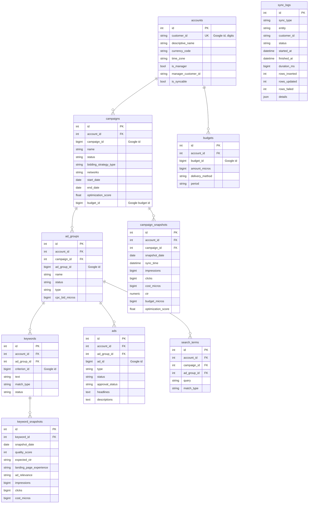

# Entity–Relationship Diagram

All tables use an internal surrogate integer PK (`id`). Google's own ids are
stored separately in `*_id` (BigInteger) columns. Snapshot tables are
append-only and carry `snapshot_date`, `sync_time`, `account_id`, `sync_log_id`.

## Dimension ↔ snapshot overview

## Full table list

| Table | Kind | Notes |
|---|---|---|
| `accounts` | dimension | MCC + client accounts |
| `campaigns` | dimension | natural key `(account_id, campaign_id)` |
| `campaign_snapshots` | snapshot | daily metrics + config |
| `campaign_device_snapshots` | snapshot | per-device metrics |
| `campaign_geo_snapshots` | snapshot | per-country metrics |
| `ad_groups` | dimension | natural key `(campaign_id, ad_group_id)` |
| `ad_group_snapshots` | snapshot | daily metrics |
| `keywords` | dimension | natural key `(ad_group_id, criterion_id)` |
| `keyword_snapshots` | snapshot | daily metrics + Quality Score |
| `ads` | dimension | natural key `(ad_group_id, ad_id)` |
| `ad_snapshots` | snapshot | daily metrics + approval status |
| `search_terms` | dimension | natural key `(ad_group_id, query, match_type)` |
| `search_term_snapshots` | snapshot | daily metrics |
| `budgets` | dimension | natural key `(account_id, budget_id)` |
| `budget_snapshots` | snapshot | daily amount, spend, utilization |
| `recommendations` | snapshot | point-in-time active recommendations |
| `sync_logs` | operational | one per entity/account run |
| `api_tokens` | operational | Phase 2 per-tenant OAuth (encrypted) |
| `users` | operational | Phase 2 RBAC placeholder |

## Indexing

Snapshot tables are indexed on `snapshot_date`, `account_id`, `sync_time`, and
their entity FK, which covers the date-range + account scans the dashboard
aggregates perform. Dimension natural keys are enforced with unique constraints.
